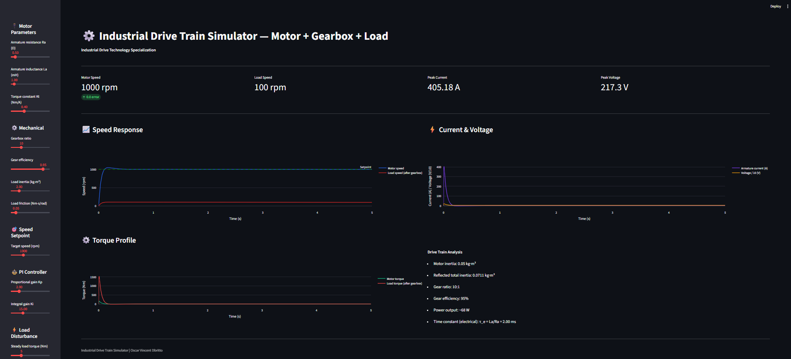
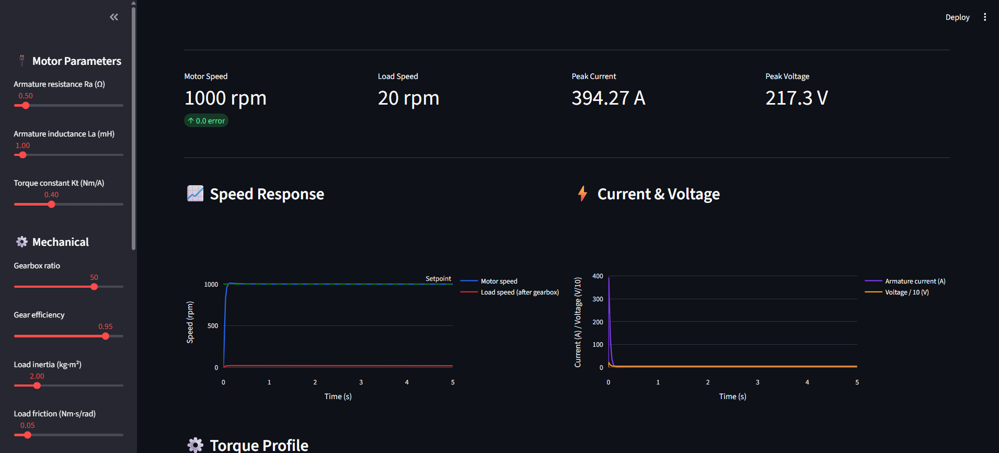
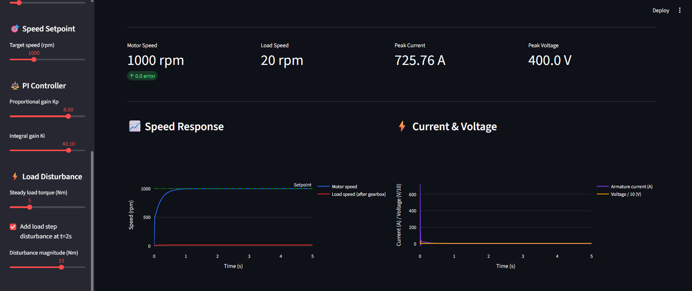

# ⚙️ Industrial Drive Train Simulator
 

 
## Overview
Complete electromechanical drive train simulator: DC motor + gearbox
+ inertia load with closed-loop PI speed control. Demonstrates motor
dynamics, gearbox reflection, and disturbance rejection.
 
## 🔗 Live Demo
**[Open Simulator](https://drive-train-simulator-ammmqucahudie3zr3xs5nz.streamlit.app/)**
 
## Features
- Full DC motor electrical + mechanical dynamics
- Gearbox modeling with efficiency and inertia reflection
- PI speed controller with anti-windup
- Configurable gear ratios (5:1 to 100:1)
- Load disturbance injection with recovery analysis
- Real-time current, voltage, torque, and speed plots
 
## Drive Train Equations
**Electrical:** V = i·Ra + La·di/dt + Kb·ω
**Mechanical:** J_eq·dω/dt = Kt·i − B_eq·ω − T_load_reflected
**Inertia reflection:** J_eq = J_motor + J_load / (n²·η)
 
## Test Scenarios
### High Gear Ratio (50:1)

 
### Disturbance Rejection

 
## Relevance to RPTU MEfIS
- Specialization: "Industrial Drive Technology"
- "Excellent qualifications for simulating complex drive systems"
- Drive system analysis and design methods
 
## Tools
Python, Streamlit, SciPy (odeint), NumPy, Plotly
 
## Author
**Oscar Vincent Dbritto** | M.Sc. Digitalization & Automation | [Portfolio](https://oscardbritto.framer.website/) | [Linkedin](https://www.linkedin.com/in/oscar-dbritto/)
